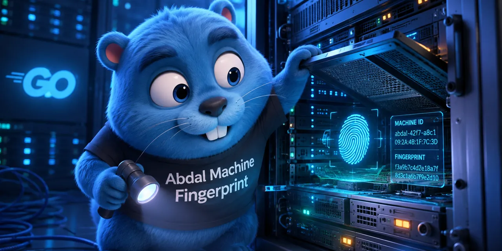

<div align="right">
  
</div>

[English](README.md) | **فارسی**

# Abdal Machine Fingerprint

کتابخانه Cross-Platform زبان Go برای شناسایی پایدار ماشین و تولید Fingerprintهای رمزنگاری‌شده.

**ماژول:** `github.com/ebrasha/abdal-machine-fingerprint`  
**پکیج:** `abdalmf`  
**نسخه Go:** 1.25+

---

## 🎯 چرا این نرم‌افزار ساخته شد؟

بسیاری از برنامه‌ها به یک **هویت پایدار ماشین** نیاز دارند؛ برای لایسنس، مدیریت دوره آزمایشی، اتصال دستگاه، Audit یا کنترل‌های امنیتی — بدون وابستگی به سریال سخت‌افزار یا Fingerprinting تهاجمی.

**Abdal Machine Fingerprint** این نیاز را با خواندن شناسه سیستم‌عامل (Windows `MachineGuid`، Linux `machine-id`، macOS `IOPlatformUUID`) و ارائه API ساده برای Hash یا محافظت از آن با رمزنگاری استاندارد برطرف می‌کند.

مناسب برای:

- نرم‌افزارهای دسکتاپ و Workstation
- سرورهای اختصاصی
- VPS و Cloud Instance
- محیط‌های Offline و حریم‌خصوصی‌محور

این کتابخانه هیچ درخواست شبکه، Telemetry یا Log خودکاری انجام نمی‌دهد.

---

## ✨ ویژگی‌ها و قابلیت‌ها

- **Machine ID خام** — `AbdalID()` شناسه نرمال‌شده سیستم‌عامل را برمی‌گرداند
- **Fingerprint هش‌شده** — `AbdalHash()` با ۱۶ الگوریتم Hash قابل انتخاب
- **Fingerprint محافظت‌شده** — `AbdalProtected()` با HMAC یا keyed BLAKE2
- **API صریح HMAC** — `AbdalHMAC()` برای Fingerprint اختصاصی هر Application
- **Encoding سفارشی** — `AbdalEncode()` با پشتیبانی HEX، HEX-UPPER، BASE64، BASE64URL
- **Cross-Platform** — Windows، Linux، macOS
- **سازگار با VPS و Cloud** — از هویت سطح OS استفاده می‌کند، نه سریال مادربرد یا CPU
- **کاملاً Offline** — بدون HTTP، Telemetry، Analytics یا Tracking
- **Thread-Safe** — امن برای استفاده همزمان از چند Goroutine
- **Deterministic** — ورودی‌های یکسان همیشه خروجی یکسان تولید می‌کنند

---

## 🚀 نحوه استفاده

### نصب

```bash
go get github.com/ebrasha/abdal-machine-fingerprint
```

### Import

```go
import "github.com/ebrasha/abdal-machine-fingerprint"
```

### Machine ID خام

```go
id, err := abdalmf.AbdalID()
if err != nil {
    // مدیریت خطا
}
```

> **حریم خصوصی:** `AbdalID()` شناسه خام ماشین را برمی‌گرداند. مسئولیت نگهداری، نمایش و ارسال آن بر عهده Developer است.

### Hash با SHA-256

```go
fingerprint, err := abdalmf.AbdalHash("SHA256")
```

### Hash با SHA-512

```go
fingerprint, err := abdalmf.AbdalHash("SHA512")
```

### Hash با SHA3-512

```go
fingerprint, err := abdalmf.AbdalHash("SHA3-512")
```

### Fingerprint محافظت‌شده

```go
fingerprint, err := abdalmf.AbdalProtected(
    "abdal-security-tools",
    "SHA256",
)
```

### Fingerprint با HMAC

```go
fingerprint, err := abdalmf.AbdalHMAC(
    "abdal-security-tools",
    "SHA512",
)
```

### Encoding سفارشی خروجی

```go
fingerprint, err := abdalmf.AbdalEncode(
    "abdal-security-tools",
    "SHA256",
    "BASE64URL",
)
```

---

## 🔐 الگوریتم‌های Hash پشتیبانی‌شده

`MD5`، `SHA1`، `SHA224`، `SHA256`، `SHA384`، `SHA512`، `SHA512-224`، `SHA512-256`، `SHA3-224`، `SHA3-256`، `SHA3-384`، `SHA3-512`، `BLAKE2B-256`، `BLAKE2B-384`، `BLAKE2B-512`، `BLAKE2S-256`

نام الگوریتم‌ها **Case-Insensitive** و **Format-Tolerant** هستند (`SHA-256`، `sha256`، `SHA_256`، `SHA3512`).

خروجی پیش‌فرض APIهای Hash و Protected، **hexadecimal با حروف کوچک** است.

---

## 📦 Encodingهای پشتیبانی‌شده

| Encoding | توضیح |
|----------|-------|
| `HEX` | Hex با حروف کوچک (پیش‌فرض) |
| `HEX-UPPER` | Hex با حروف بزرگ |
| `BASE64` | Base64 استاندارد |
| `BASE64URL` | Base64 امن برای URL بدون padding |

---

## 🖥️ منابع شناسایی در هر پلتفرم

| پلتفرم | منبع |
|--------|------|
| Windows | `HKLM\SOFTWARE\Microsoft\Cryptography\MachineGuid` |
| Linux | `/var/lib/dbus/machine-id` → `/etc/machine-id` |
| macOS | `IOPlatformUUID` از طریق IOKit بومی (CGO) |

### نکته Build روی macOS

macOS از IOKit بومی با CGO استفاده می‌کند. Build را با CGO فعال انجام دهید:

```bash
CGO_ENABLED=1 go build ./...
```

---

## ⚠️ مدیریت خطا

از `errors.Is()` با خطاهای زیر استفاده کنید:

| خطا | زمان رخداد |
|-----|-----------|
| `abdalmf.ErrMachineIDNotFound` | Machine ID در دسترس نیست یا خالی است |
| `abdalmf.ErrUnsupportedPlatform` | سیستم‌عامل پشتیبانی نمی‌شود |
| `abdalmf.ErrUnsupportedAlgorithm` | الگوریتم Hash نامعتبر است |
| `abdalmf.ErrUnsupportedEncoding` | Encoding نامعتبر است |
| `abdalmf.ErrEmptyApplicationID` | Application ID خالی ارسال شده |
| `abdalmf.ErrUnsupportedHMACAlgorithm` | الگوریتم برای HMAC/Protected معتبر نیست |

---

## 📁 ساختار پروژه

```
abdal-machine-fingerprint/
├── فایل‌های API عمومی (abdalmf)
└── core/
    ├── encode/
    ├── hash/
    ├── machine/
    ├── normalize/
    └── platform/
```

---

## 🐛 گزارش مشکلات

اگر با مشکلی مواجه شدید یا در پیکربندی مشکل دارید، لطفاً از طریق ایمیل Prof.Shafiei@Gmail.com با ما در تماس باشید. همچنین می‌توانید مشکلات را در GitLab یا GitHub گزارش دهید.

## ❤️ حمایت مالی

اگر این پروژه برای شما مفید بود و مایل به حمایت از توسعه بیشتر هستید، لطفاً در نظر داشته باشید که کمک مالی کنید:

- [اینجا اهدا کنید](https://t.me/AbdalDonationBot)

## 🤵 برنامه‌نویس

ساخته شده با عشق توسط **ابراهیم شفیعی (EbraSha)**

- **ایمیل**: Prof.Shafiei@Gmail.com
- **تلگرام**: [@ProfShafiei](https://t.me/ProfShafiei)

## 📜 مجوز

این پروژه تحت مجوز AGPLv3 منتشر شده است.
